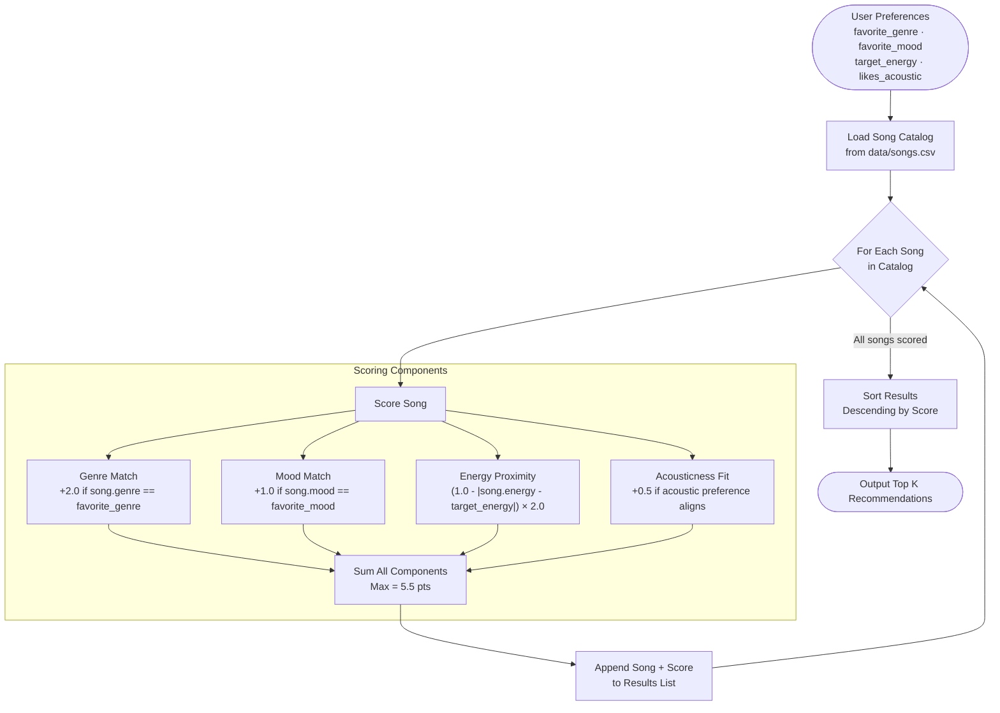
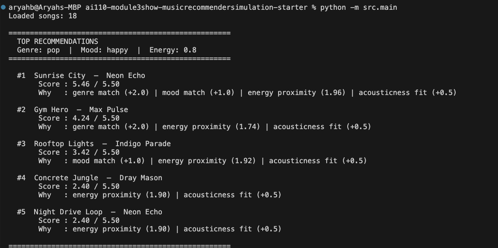
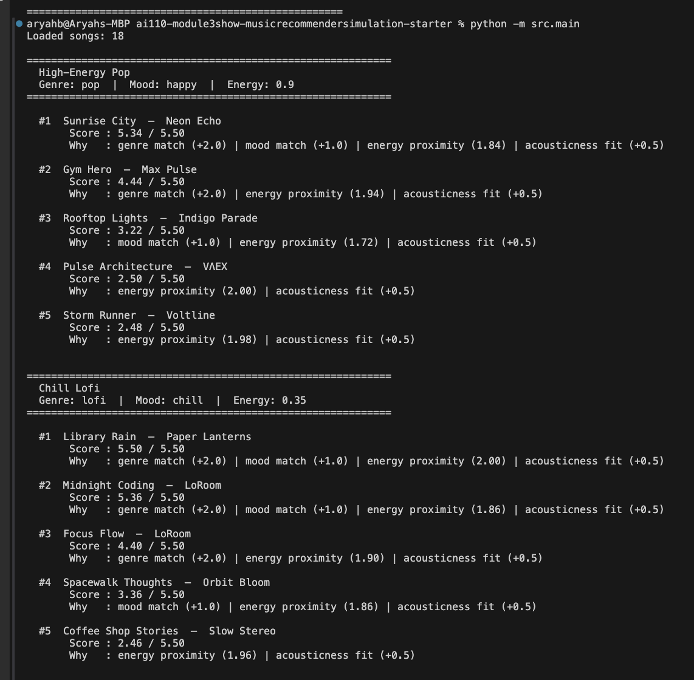
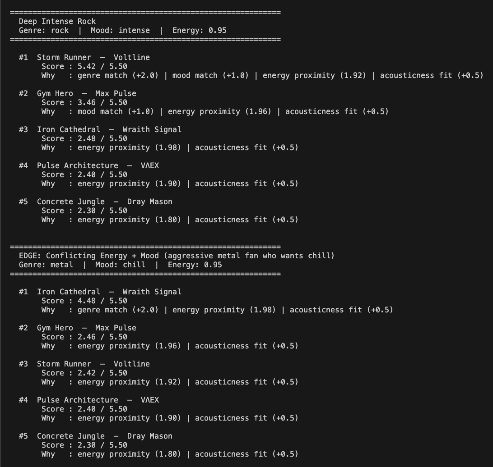
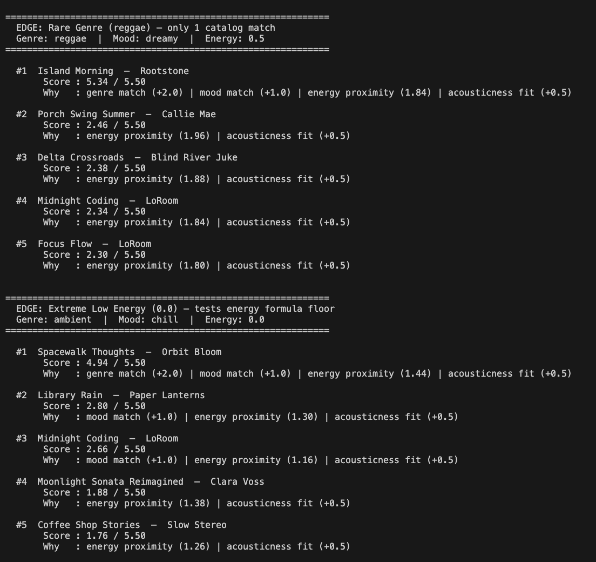
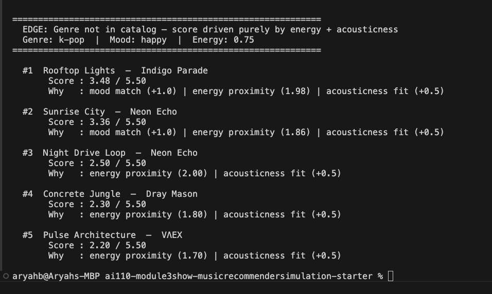

# 🎵 Music Recommender Simulation

## Project Summary

In this project you will build and explain a small music recommender system.

Your goal is to:

- Represent songs and a user "taste profile" as data
- Design a scoring rule that turns that data into recommendations
- Evaluate what your system gets right and wrong
- Reflect on how this mirrors real world AI recommenders

This project simulates a content-based music recommender. Given a user's preferred genre, mood, and energy level, the system scores every song in a small catalog and returns the top matches. Unlike real-world systems that rely on millions of users' behavior, this version uses only song attributes — making every recommendation fully explainable by pointing to specific features like genre, mood, and energy proximity.

---

## How The System Works

Real-world music recommenders like Spotify and YouTube use two main strategies: **collaborative filtering** (finding users with similar taste and borrowing their picks) and **content-based filtering** (matching songs by their actual audio attributes). Spotify's Discover Weekly leans on collaborative filtering — it finds your "taste twins" — while its Radio feature uses content-based filtering on audio features like energy and valence. This simulation prioritizes content-based filtering because it works immediately with a small catalog and every recommendation can be directly explained by pointing to specific song attributes.

### Song Features Used

Each `Song` object stores the following attributes from `data/songs.csv`:

- **genre** — categorical (pop, lofi, rock, ambient, jazz, synthwave, indie pop)
- **mood** — categorical (happy, chill, intense, relaxed, moody, focused)
- **energy** — numeric 0.0–1.0 (intensity/activity level)
- **acousticness** — numeric 0.0–1.0 (acoustic vs. electronic feel)
- **valence** — numeric 0.0–1.0 (musical happiness/positivity)
- Supporting: `tempo_bpm`, `danceability`, `title`, `artist`, `id`

### UserProfile Features

Each `UserProfile` stores the user's taste preferences:

- **favorite_genre** — the genre they want to prioritize
- **favorite_mood** — the emotional vibe they are looking for
- **target_energy** — a number 0.0–1.0 representing their preferred intensity
- **likes_acoustic** — boolean, whether they prefer acoustic over electronic sounds

### Scoring Rule (one song)

The recommender computes a score for each song using weighted feature matching:

| Feature | Rule | Points |
|---|---|---|
| Genre match | `+3.0` if genre matches user's favorite | up to 3.0 |
| Mood match | `+2.0` if mood matches user's favorite | up to 2.0 |
| Energy proximity | `(1.0 - abs(song.energy - target_energy)) × 2.0` — rewards closeness, not just high/low | up to 2.0 |
| Acousticness fit | `+1.0` if preference aligns with song's acousticness | up to 1.0 |

Genre carries the most weight because it is the strongest single predictor of whether a song fits a user's taste. The energy formula uses proximity math (`1 - |difference|`) so a user targeting 0.8 energy gets penalized for songs at 0.3 just as much as for songs at 0.2 — it rewards closeness rather than simply "higher is better."

### Ranking Rule (choosing recommendations)

The system calculates a score for every song in the catalog, sorts all songs from highest to lowest score, and returns the top `k` results. The scoring rule handles one song at a time; the ranking rule applies it across the full catalog and selects the winners.

### Algorithm Recipe

Each song is evaluated against the user's profile using a four-component scoring function with a maximum possible score of **5.5 points**. All songs are ranked by score descending and the top K are returned.

| Component | Rule | Max Points |
|---|---|---|
| Genre match | `+2.0` if `song.genre == favorite_genre` | 2.0 |
| Mood match | `+1.0` if `song.mood == favorite_mood` | 1.0 |
| Energy proximity | `(1.0 - abs(song.energy - target_energy)) × 2.0` | 2.0 |
| Acousticness fit | `+0.5` if acoustic preference aligns with song | 0.5 |

Genre carries the most weight because it is the broadest signal of a listener's style — it encapsulates instrumentation, cultural context, and production style all at once. Energy proximity uses a closeness formula so a user targeting `0.8` energy is penalized equally for a `0.2` song as a `1.4` song — it rewards matching, not maximizing.

> **Potential bias:** This system may over-prioritize genre, causing great mood and energy matches to be buried if they belong to a different genre. A song that perfectly matches a user's target energy and mood but is the wrong genre can score at most 3.5 out of 5.5, while a low-energy, off-mood song in the correct genre still scores 2.0 — potentially outranking it.

### Data Flow



---

## Getting Started

### Setup

1. Create a virtual environment (optional but recommended):

   ```bash
   python -m venv .venv
   source .venv/bin/activate      # Mac or Linux
   .venv\Scripts\activate         # Windows

2. Install dependencies

```bash
pip install -r requirements.txt
```

3. Run the app:

```bash
python -m src.main
```

### Running Tests

Run the starter tests with:

```bash
pytest
```

You can add more tests in `tests/test_recommender.py`.

---

## Experiments You Tried

Use this section to document the experiments you ran. For example:

- What happened when you changed the weight on genre from 2.0 to 0.5
- What happened when you added tempo or valence to the score
- How did your system behave for different types of users

---

## Limitations and Risks

Summarize some limitations of your recommender.

Examples:

- It only works on a tiny catalog
- It does not understand lyrics or language
- It might over favor one genre or mood

You will go deeper on this in your model card.

---

## Reflection

Read and complete `model_card.md`:

[**Model Card**](model_card.md)

Write 1 to 2 paragraphs here about what you learned:

- about how recommenders turn data into predictions
- about where bias or unfairness could show up in systems like this


---

## 7. `model_card_template.md`

Combines reflection and model card framing from the Module 3 guidance. :contentReference[oaicite:2]{index=2}  

```markdown
# 🎧 Model Card - Music Recommender Simulation

## 1. Model Name

Give your recommender a name, for example:

> VibeFinder 1.0

---

## 2. Intended Use

- What is this system trying to do
- Who is it for

Example:

> This model suggests 3 to 5 songs from a small catalog based on a user's preferred genre, mood, and energy level. It is for classroom exploration only, not for real users.

---

## 3. How It Works (Short Explanation)

Describe your scoring logic in plain language.

- What features of each song does it consider
- What information about the user does it use
- How does it turn those into a number

Try to avoid code in this section, treat it like an explanation to a non programmer.

---

## 4. Data

Describe your dataset.

- How many songs are in `data/songs.csv`
- Did you add or remove any songs
- What kinds of genres or moods are represented
- Whose taste does this data mostly reflect

---

## 5. Strengths

Where does your recommender work well

You can think about:
- Situations where the top results "felt right"
- Particular user profiles it served well
- Simplicity or transparency benefits

---

## 6. Limitations and Bias

Where does your recommender struggle

Some prompts:
- Does it ignore some genres or moods
- Does it treat all users as if they have the same taste shape
- Is it biased toward high energy or one genre by default
- How could this be unfair if used in a real product

---

## 7. Evaluation

How did you check your system

Examples:
- You tried multiple user profiles and wrote down whether the results matched your expectations
- You compared your simulation to what a real app like Spotify or YouTube tends to recommend
- You wrote tests for your scoring logic

You do not need a numeric metric, but if you used one, explain what it measures.

---

## 8. Future Work

If you had more time, how would you improve this recommender

Examples:

- Add support for multiple users and "group vibe" recommendations
- Balance diversity of songs instead of always picking the closest match
- Use more features, like tempo ranges or lyric themes

---

## 9. Personal Reflection

A few sentences about what you learned:

- What surprised you about how your system behaved
- How did building this change how you think about real music recommenders
- Where do you think human judgment still matters, even if the model seems "smart"

## Ouput



## Each profile's recommendations








